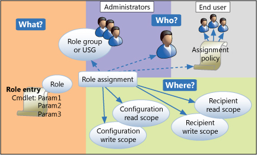

## Intro
So, it happened. Microsoft had finally started to shutdown basic auth on M365 tenants. You could not avoid to hear this news, it was all over M365 portal, blogs, Twitter... and it happend on [1st of October 2022.](https://techcommunity.microsoft.com/t5/exchange-team-blog/exchange-online-email-applications-stopped-signing-in-or-keep/ba-p/3641943) in case you were living under rock and missed it.

Prior killing basic auth it was needed to update unattended PowerShell scripts to use app-only authentication. Microsoft did made this possible by introducing new [ExO PoSh module](https://learn.microsoft.com/en-us/powershell/exchange/app-only-auth-powershell-v2?view=exchange-ps). It's a streight forward process, but you need to create [Azure app](https://learn.microsoft.com/en-us/azure/active-directory/develop/app-objects-and-service-principals) to use it. 

## Scope(s) and roles
This were I come to the point of writing this blog post. If you're using this approach not being mindful of **scope**, application/script that is going to be using this service principal will have access on ExO tenant level.

**Why should I care?**  Well, it's a matter of least privilage principle. You want to give application only access that is needs and write scope on objects that it needs to mange. 

## Exchange RBAC primer

Exchange Role Based Access Control (RBAC) it's quite complex topic and it offers granularity to great extent. I will not get into details, plenty of articles on the net do good explanation. To get started I'll explaing several important concepts.
{: .mx-auto.d-block :}

### Who?
Role group membership controls "**Who?**" (admin or end-user) can do. Which roles will be available to account. Basically, role group is a collection of roles.
### What?
Each role consist of set's of PowerShell cmdlets **What?** can account do. Each cmdlet consists of parameters and switches (Yes, this is how deep you go when customizing roles).
### Where?
Management role scopes define targets "**Where**?" cmdlets can be used. 

### Role assigment
I wanted to skip this but still... In case you're wondering what Role assigment is. It's a "glue" that links role, role group and scope. It's generated when you add role to a role group and scope.

## Connecting to ExO
When account logs into ExO PowerShell session using interactive logon session it will pick-up everything that is defined in ExO role groups (roles, scopes) that they are member of.

{: .box-note}
Since basic auth is turned off and interactive logon is no good for unatended scripts. Only way forward is to use app-only authentication. 

How can I control "**What?**" my principal in unatended script  will be able to change/modify?

Well, you can't assign roles in ExO directly for this approach. And only two ExO built-in [roles](https://learn.microsoft.com/en-us/powershell/exchange/app-only-auth-powershell-v2?view=exchange-ps#step-5-assign-azure-ad-roles-to-the-application) in Azure AD roles are available. Unfortunatelly, custom AAD roles for ExO are not supported and roles created in ExO are not visible in AAD. 

But what about scoping? "**Where?**" part now becomes ExO tenant level. That might be fine in some cases where you need to manage whole tenant. But for [paranoid](https://www.youtube.com/watch?v=uk_wUT1CvWM) people, like myself I don't want that some unattended script holds ultimate power and modify all objects on my tenant. Especially if it's some "other" team's responsibility. 

## Conclusion
How do I control it and restrict access to specific scope?. Well at this point in time, if you're using app-only authentication you can't. It only works as specified in guide and **scope is org-wide**.

## Appendix 1
I ran into excellent article by [Vasil Michev
](https://www.michev.info/Blog/Post/4027/more-on-service-principal-permissions-in-exchange-online) where he reveals what's visible behind the curtains in ExO environment. So, one would think that ServicePrincipal if added to the role will actually inherit the role priviliges. However, it looks like you can't "skip" AAD role groups. I tried this and as expected it resulted in error.

```powershell
#Create custom Role,Scope and RoleGroup
New-ManagementScope -Name "Custom-EU-Corp" -RecipientRestrictionFilter "(PrimarySmtpAddress -like '*@evilcorp.com'"
new-ManagementRole Custom_MailRecipients_EU-Corp -Parent "Mail Recipients"
New-RoleGroup -Name Custom-EU-Corp -Roles Custom_MailRecipients_EU-Corp -CustomRecipientWriteScope "Custom-EU-Corp"
New-ServicePrincipal -AppId 722eae44-xxxx-xxxx-xxxx-ee2932067dd9  -ServiceId 00000002-0000-0ff1-ce00-000000000000
Add-RoleGroupMember -Identity Custom-EU-Corp -Member 722eae44-xxxx-xxxx-xxxx-ee2932067dd9 

#Connect to ExO via app-only same as ExO ServicePrincipal
Connect-ExchangeOnline -CertificateThumbprint "4528C77ADE7869B4E6BFE23EEE9FBE70B48181F0" -AppId 722eae44-xxxx-xxxx-xxxx-ee2932067dd9 -Organization M365Bxxxxxxx.onmicrosoft.com

#Lovely error
Exception: Processing data from remote server outlook.office365.com failed with the following error message: [AuthZRequestId=ac4bc3f3-795d-444f-81dc-b94c8bc24941][FailureCategory=AuthZ-CmdletAccessDeniedException] The
role assigned to application 722eae44-xxxx-xxxx-xxxx-ee2932067dd9 isn't supported in this scenario. Please check online documentation for assigning correct Directory Roles to Azure AD Application for EXO
App-Only Authentication. For more information, see the about_Remote_Troubleshooting Help topic.
```

## Appendix 2

Organizations commonly used role legacy is ApplicationImperonation for various application integrations. Usually, app would need to manage only subset of mailboxes in environment, room resources. Only way forward is turn to MSGraph.

For example meetingroom booking vendor Evoko has a [guide how to setup azure app](https://support.meetevoko.com/hc/en-us/articles/360019252551-Register-oAuth-with-EWS-for-Microsoft-365-and-Evoko-Home). There's nothing wrong with this guide. But it's missing the part that says you're allowing permissions tenant wide again. But fortunately for us that can be scoped to only mailboxes that need to be managed.

Introducing [Application access policies](https://learn.microsoft.com/en-us/graph/auth-limit-mailbox-access). 

In nutshell how this works. Assuming you already have Azure app configured. To scope the access on ExhangeOnline you'll need to:
- Create mail-enabled security group
- Add mailboxes as members that you want to manage
- Create ApplicationAccessPolicy on ExO
```powershell
New-ApplicationAccessPolicy -AppId e7e4dbfc-046f-4074-9b3b-2ae8f144f59b -PolicyScopeGroupId EvokoUsers@contoso.com -AccessRight RestrictAccess -Description "Restrict this app to members of distribution group EvokoUsers."
```
That's it. Almost good as ExO ApplicationImpersonation role, but now you don't get benifit of using dynamic scope that Exhange has built-in. You need to manage membership of  mail-enabled security group that acts as scope.