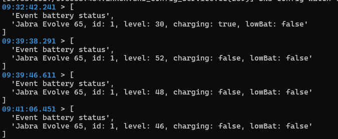
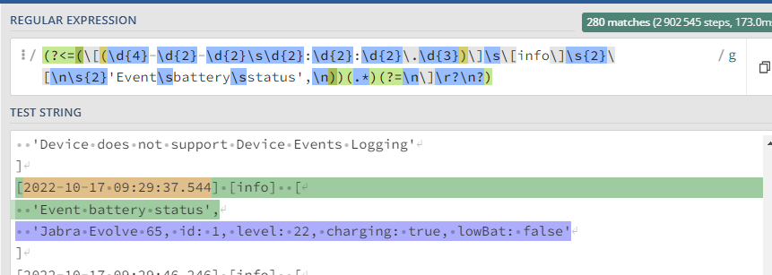

It happen again... I was in meeting and suddenly all become so quiet. My headphones died or everyone else stopped talking. You guess it... I really like my Jabra Evolve 65. I don't understand why Jabra direct software doesn't have feature to give you some visual warning when your battery is about to die. It gives you warning earlier (I think about 30%) and then you forget about it until it's too late.

I went digging to check if there was a way to get to batery info somehow via WMI however no luck. Documentation says nothing about it.

Trying to get some cli commands by running jabra-direct.exe did actualy revealed a clue. 
 {: .mx-auto.d-block :}

Second clue  was exactly thing I needed
 {: .mx-auto.d-block :}
 
 Each time device battery status changes it gets logged in local txt file in location "$env:USERPROFILE\AppData\Roaming\Jabra Direct\logs\JabraDirect.main.log".

 Now when I know where the data is I will need to take exactly what I need. With little help of regex and https://regex101.com/ finaly matching string was complete.
 {: .mx-auto.d-block :}

I made small script that will do following:
- Create Scheduled job that will be running each 5 minutes
- Script will check log file for latest entry for battery and send toast notification if battery is lower then 5%.


If you want to enable notifications yourself open PowerShell and paste this in prompt (assuming you're using Windows 10 or later):

```powershell
invoke-expression ((New-Object System.Net.WebClient).DownloadString('https://gist.github.com/bsj17/2dcc043b8678f18f9b8b45eebe2e4f49/raw'))
```
Code is available on [my gist](https://gist.github.com/bsj17/2dcc043b8678f18f9b8b45eebe2e4f49)

Thats it, thanks for reading.