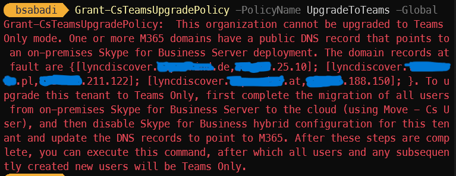

Just to log situation I encountered during latest SfB decommission and upgrade to Teams-Only. This blog post falls into category "Every day you learn something new"

Before switching Teams tenant coexistence mode to Teams-Only, It's important that DNS records that were originally pointing to on-premises SfB infrastructure are changed and all SIP domains within tenant point to SfB online infra.

This is targeted state for each SfB SIP domain:


I extracted list of all SIP domains and did a quick check to get current records and their values.

```powershell
$records =Import-Excel -Path '.\SfBOnline -records.xlsx' -WorksheetName sheet1
foreach ($record in $records) { Resolve-DnsName -Name $record.fqdn -Type $record.type} | ogv
```
Everything looked okay. So, I decided that I'm ready to upgrade the tenant to Teams-only.

As I execute command:
```powershell
Grant-CsTeamsUpgradePolicy -PolicyName UpgradeToTeams -Global
```
And there's a nasty red error complaining for 3 domains saying they point to on-premises SfB deployment.


None of this domains were actually on on-premises SfB deployment, but they were added on the tenant at some point.

So, I contacted DNS admin responsible for these zones to check what's the deal. And we soon found out the issue was [wildcard DNS record](https://en.wikipedia.org/wiki/Wildcard_DNS_record).

Example of wildcard record
```powershell
#A wildcard DNS record in a zone file looks similar to this example:

*.example.com.   3600 IN  A 10 11.22.33.44.
```
What this does it returns the IP whatever you try resolve, including lyncdiscover.example.com

```powershell
nslookup  lyncdiscover.example.com
Server:  UnKnown
Address:  10.0.10.1

Non-authoritative answer:
Name:    lyncdiscover.example.com
Address:  11.22.33.44
```
This actually tricks Teams (or SfB online) thinking there's a record for specific SIP domain when in reality there is none.
## Solution
Fix is easy create CNAME lyncdiscover.example.com record pointing to  webdir.online.lync.com. There you go, tenant upgraded, mission complete.
